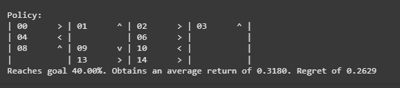

# SARSA Learning Algorithm


## AIM
To develop a Python program to find the optimal policy for the given RL environment using SARSA-Learning and compare the state values with the Monte Carlo method.

## PROBLEM STATEMENT
To find the optimal policy for the given RL environment using SARSA-Learning.

## SARSA LEARNING ALGORITHM
#### Step1 : 
Set Q-values to zero for all state-action pairs. Prepare ε-greedy policy and decay schedules for ε and α.

#### Step2:
For each episode, interact with the environment using ε-greedy policy.
Update Q-values using SARSA rule: 
𝑄
(
𝑠
,
𝑎
)
←
𝑄
(
𝑠
,
𝑎
)
+
𝛼
⋅
[
𝑟
+
𝛾
𝑄
(
𝑠
′
,
𝑎
′
)
−
𝑄
(
𝑠
,
𝑎
)
]


#### Step3:
After all episodes, derive π(s) = argmaxₐ Q(s,a). Compute value function V(s) = maxₐ Q(s,a) for each state.

## SARSA LEARNING FUNCTION
### Name: Shaik Shoaib Nawaz
### Register Number: 212222240094
```
def sarsa(env,
          gamma=1.0,
          init_alpha=0.5,
          min_alpha=0.01,
          alpha_decay_ratio=0.5,
          init_epsilon=1.0,
          min_epsilon=0.1,
          epsilon_decay_ratio=0.9,
          n_episodes=3000):
    nS, nA = env.observation_space.n, env.action_space.n
    pi_track = []
    Q = np.zeros((nS, nA), dtype=np.float64)
    Q_track = np.zeros((n_episodes, nS, nA), dtype=np.float64)

    # Write your code here
    select_action = lambda state, Q, epsilon: np.argmax(Q[state]) \
        if np.random.random() > epsilon \
        else np.random.randint(len(Q[state]))
    alphas=decay_schedule(init_alpha, 
                           min_alpha, 
                           alpha_decay_ratio, 
                           n_episodes)
    epsilons=decay_schedule(init_epsilon, 
                              min_epsilon, 
                              epsilon_decay_ratio, 
                              n_episodes)
    for e in tqdm(range(n_episodes), leave=False):
        state,done = env.reset(),False;
        action=select_action(state,Q,epsilons[e])
        while not done:
            next_state,reward,done,_=env.step(action)
            next_action=select_action(next_state,Q,epsilons[e])
            td_target=reward+gamma*Q[next_state][next_action]*(not done);
            td_error=td_target-Q[state][action];
            Q[state][action]=Q[state][action]+alphas[e]*td_error
            state,action=next_state,next_action;
        Q_track[e] = Q
        pi_track.append(np.argmax(Q, axis=1))
    V=np.max(Q,axis=1)
    pi=lambda s:{s:a for s,a in enumerate(np.argmax(Q,axis=1))}[s]
    
    return Q, V, pi, Q_track, pi_track
```

## OUTPUT:





## RESULT:
Thus, The Python program to find the optimal policy for the given RL environment using SARSA-Learning is executed successfully.
